# N-Tier Architecture

```mermaid
    architecture-beta
        group app[Application]
        group cc[Cross Cutting Concerns] in app
        group inf[Infrastucture]        

        service ui(font-awesome:fa-cubes)[Presentation Layer] in app
        service svc(application)[Business Layer] in app
        service dal(logos:application)[Data Access Layer] in app

        service models(model)[Domain Models] in cc

        service db(database)[Data Access Layer] in inf
                
        junction appright in app
        junction apprightdown in app
        junction svcright in app
        junction dalright in app
        junction dalrightup in app

        ui:B --> T:svc
        ui:R <-- L:appright
        appright:B -- T:svcright

        svc:B --> T:dal
        svc:R <-- L:svcright
        svcright:R -- L:models

        dal:B --> T:db
        dal:R <-- L:dalright
        dalright:T -- B:svcright        
```

## Description

This is a general architecture diagram for a typical N-Tier application. The N-Tier architecture layers are broken apart into responsibility groupings to keep the application modular and maintainable while also reducing dependencies between those logical layers.

### Presentation Layer
Presentation layer, though not necessarily a UI is the general entry point into the application. Its responsibility is defining what the application does, providing an application interface, input validation, and input processing. It is also responsible for the presentation of any resulting data to the user. 

### Business Layer
Business layer is generally where any "Business logic" is defined.  This is where the application defines how it will process the input data it receives from the Presentation Layer.  It is also responsible for any data transformation that needs to occur before the data is persisted to the data store or before the data is returned to the presentation.

### Data Access Layer
Data Access Layer is responsible for the actual storage and retrieval of data.  This layer is responsible for the actual CRUD operations on the data store.  It is also responsible for any data transformation that needs to occur before the data is returned to the business layer.

### Domain Models
Domain models are the actual data structures that are used throughout the application. Though the domain models can strongly represent the persisted data in the data store, that isn't always necessary or true and can be Frankenstein’d inside of the Data Access Layer depending on the needs or requirements of the application. These models are shared between the Presentation Layer, Business Layer, and the Data Access Layer. 

## How it works
N-Tier architecture forces separation of concerns and reduces dependencies between the logical layers. Presentation Layer should only ever know of the Business layer through its interfaces. Likewise, the Business Layer should only know of the Data Access Layer, not the Presentation Layer or the actual data store. The Data Access Layer should only know of the data store, however all layers should know of the domain models that span the entire domain of the application. 

If you follow the N-Tier architecture diagram above, you will notice each layer only has exposure to the layer below it, but all know the overall domain models in use. Using a classic analogy, if you go out to eat at a restaurant, your server (Presentation Layer) presents you with a menu (Interface) of types of meals they produce for you to order from. You would not need to know how many people are in the kitchen, what they're process is for making your meal, how they get their ingredients, or what kind of equipment they are working with. The only thing you care about is giving criteria for the meal you want and they do the work and give you back the result. Each layer in the N-Tier architecture functions in this way. Presentation Layer allows input, which calls the Business Layer to process the input, which in turn uses the data access layer to store and retrieve the data, and then the result is returned up the chain to the Presentation Layer. 

## Conclusion
By following a N-Tier architecture the application really becomes about the Domain Models and not different facets of the layers, allowing for the overall application to not be bound to the technology its written in or the type of application it is, each layer can be easily swapped out for a different technology or implementation without affecting the other layers. 

